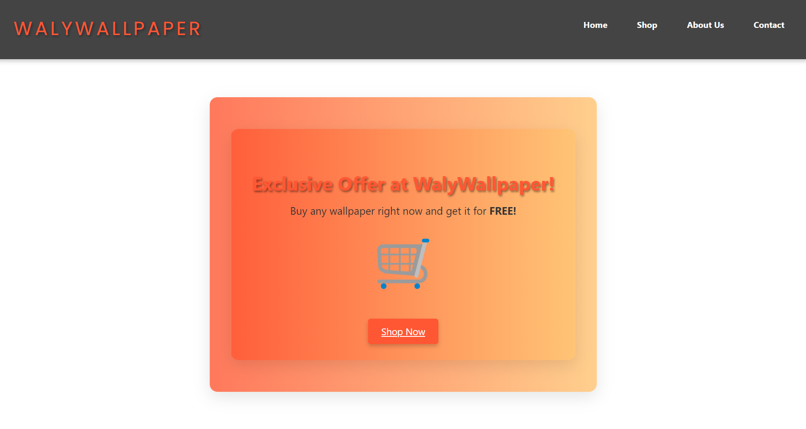
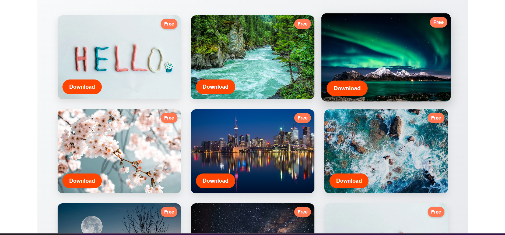
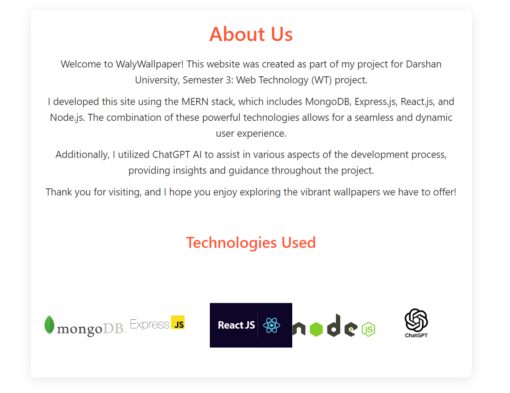
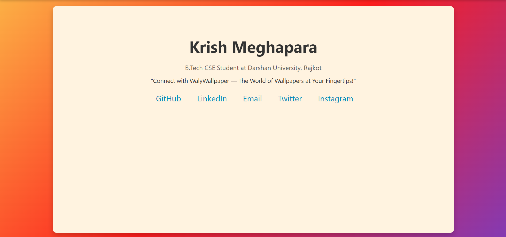

# 🎉 **WalyWallpaper** - A MERN Stack Wallpaper Store  

WalyWallpaper is your one-stop destination for **high-quality wallpapers**, built with the power of the **MERN Stack**. Inspired by platforms like **Unsplash**, this project delivers a seamless user experience to browse, download, and shop for wallpapers.  
> 📚 **Project by:** **Krish Meghapara** as part of Semester 3 WT Project at **Darshan University**.  

  

---

## 🌟 **Key Features**  

### 🎁 **Exciting Offers Just for You!**  
Stay updated with **amazing offers** tailored for all wallpaper enthusiasts!  

  

### 🛒 **Browse and Shop Effortlessly**  
Navigate through beautifully categorized wallpapers and choose your favorites with ease.  

  

### 💡 **Learn About Us**  
Discover the journey, inspiration, and technology behind **WalyWallpaper**.  

  

### 📩 **Stay Connected**  
Have questions or feedback? Get in touch via the Contact page!  

  

---

## 💻 **Technology Stack**  

WalyWallpaper is powered by:  
- **Frontend:** React, Bootstrap, and ChatGPT-assisted designs  
- **Backend:** Node.js, Express.js  
- **Database:** MongoDB  

---

## 🚀 **How to Set Up WalyWallpaper Locally**  

Follow these steps to run the project on your local system:  

1. **Clone the Repository**  
   ```bash  
   git clone https://github.com/your-username/WalyWallpaper.git  
   ```  

2. **Navigate to the Project Folder**  
   ```bash  
   cd WalyWallpaper  
   ```  

3. **Install Dependencies**  
   - For the backend:  
     ```bash  
     cd backend  
     npm install  
     ```  
   - For the frontend:  
     ```bash  
     cd frontend  
     npm install  
     ```  

4. **Set Up Environment Variables**  
   - Create a `.env` file in the `backend` directory.  
   - Add the following variables:  
     ```plaintext  
     MONGO_URI=your_mongodb_connection_string  
     PORT=your_desired_backend_port  
     ```  

5. **Run the Backend Server**  
   ```bash  
   cd backend  
   npm start  
   ```  

6. **Run the Frontend**  
   Open a new terminal and run:  
   ```bash  
   cd frontend  
   npm start  
   ```  

7. **Access the Application**  
   Visit the app in your browser:  
   ```  
   http://localhost:3000  
   ```  

---

## ✨ **Why Choose WalyWallpaper?**  

- **🌈 Visually Stunning**: A beautifully designed, clean, and responsive interface.  
- **🚀 High Performance**: Smooth and fast navigation across all features.  
- **💡 AI-Assisted Development**: Built using cutting-edge technologies with the help of ChatGPT.  

---

## 👨‍💻 **About Me**  

Hi there! I’m **Krish Meghapara**, a passionate **MERN Stack Developer** and a **4th Semester B.Tech CSE Student** at **Darshan University**.  
I enjoy creating **interactive web applications** and leveraging **AI tools** like ChatGPT to bring innovative ideas to life.  

**Let’s Connect!**  
- 📧 **Email:** krishmeghapara@gmail.com  
- 🔗 **GitHub:** [github.com/krishmeghapara](https://github.com/krishmeghapara)  
- 💼 **LinkedIn:** [linkedin.com/in/krish-meghapara-49571b2a7/](https://linkedin.com/in/krish-meghapara-49571b2a7/)  

---

## 🤝 **How to Contribute**  

We welcome contributions to enhance WalyWallpaper further.  

1. **Fork the Repository**  
   ```bash  
   git fork https://github.com/your-username/WalyWallpaper.git  
   ```  

2. **Create a New Branch**  
   ```bash  
   git checkout -b feature/YourFeatureName  
   ```  

3. **Make Your Changes**  
   Implement your feature or fix bugs.  

4. **Commit and Push**  
   ```bash  
   git commit -m "Add YourFeatureName"  
   git push origin feature/YourFeatureName  
   ```  

5. **Open a Pull Request**  
   Submit your changes for review.  

---

## 📜 **License**  

This project is licensed under the **MIT License**.  

---

**Made with ❤️ by Krish Meghapara | WalyWallpaper**  
